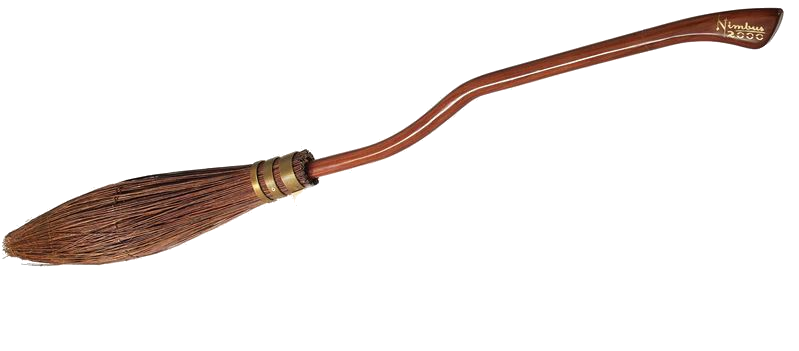

Só funciona para telas entre 320 px 780 px de comprimento;
Nem todas as atividades foram cumpridas dessa vez :(;
Aprendizados: 
Administrar melhor o tempo;
Controlar a ambição (adquirir mais conhecimento para, só assim, desenvolver projetos mais ousados);
Separar bem os estilos que devem ser colocados dentro da @media e fora dela, por exemplo, a fonte dos textos uma hora ficaram pequena demais (deviam ter sido especificadas em cada @media), não deu tempo para alterar;
Evitar repetições de estilo, para isso, definir com mais clareza cada elemento;
Estudar(muuuuuuuuuuito) mais animações;
Descobrir qual a melhor estratégia para evitar ao máximo linhas de @media;
Centralizar com flex box, margin auto esta dando muito problema; Vai ser necessário criar mais divs, porém é mais fácil de trabalhar;
Descobrir como fazer uma animação repetir a cada click (só consegui para o primeiro);
Fazer um bloco grande com dimensões width 100% e altura responsiva, dentro deste bloco, colocar outros blocos de altura e width em % (responsivo, vai poupar ter que ficar alterando um por um no @media);

 <h1>Wizard world and muggle's nature devastations</h1>
            
Wizard

            

                

                    
                    
The recent fires that devastated the Amazon, burning over 20,000 hectares of forest, caused global outrage. Many were quick to blame Brazil's president, Jair Bolsonaro, who since taking office has made it clear that protecting the
                        environment is not really a priority of his government.   Indeed, his policies and anti-preservation speech have played a major role. Earlier this year, the government cut the budget of various agencies responsible for fire
                        prevention, including the environmental inspection agency IBAMA, the fire prevention system PrevFogo, and the Chico Mendes Institute for Biodiversity Conservation (ICMBio), which inevitably affected the country's ability to cope
                        with the fires.   In addition, Bolsonaro has taken measures that encourage deforestation and promote agribusiness and mining, at the expense of the rights of indigenous people and sustainability. His fiery rhetoric also incited
                        farmers to start fires to show their support for the president in the face of international criticism.

                

                
            

            
world

            
and muggle's

            
devastations

            
                

    <article class="full-box">
        <section class="full-box flex section-one center">
            

                
                <h2 class="news-title">Scientific witches alerts about muggle's foods</h2>
            

            

                
                <h2 class="news-title">Satanic witch singer causes controversy with her new album</h2>
            

        </section>
        <section class="full-box flex section-two center">
            <h2 class="news-title position-text">Council meet in Hogwarts to discuss muggle devastation and the future of earth</h2>
        </section>
        <section class="full-box flex section-one center">
            

                
                <h2 class="news-title">The muggle muggle put in danger the world of magic</h2>
            

            

                
                <h2 class="news-title">Do we have control?</h2>
            

        </section>
    </article>
    <aside class="full-box center">
        <h2 class="news-title ad">Nimbus 5000 has arrived!</h2>
        

            

                <h2 class="news-title">1/6 the speed of light</h2>
                <h2 class="news-title">No GPS detection</h2>
            

            
        

    </aside>
    <footer class="ad-box">
        <h2 class="news-title ad">Web Developer: Anderson Bolivar</h2>
        <nav class="flex center ad-box">
            
            
            
        </nav>
        
        
    </footer>

    * Standard Propriets */

.full-box {
    width: 100%;
}

.news-box {
    width: 50%;
    height: 100%;
    margin: 2%;
}

.news-box-1 {
    width: 70%;
    height: 100%;
    margin: 2%;
}

.news-box-2 {
    width: 30%;
    height: 100%;
    margin: 2%;
}

.flex {
    display: flex;
}

.center {
    justify-content: center;
    align-items: center;
}

/* Especifiq Propriets */

header>img {
    display: block;
    margin: 0% auto;
}

.news-title {
    font-size: 70%;
    background-color: #1c1915;
    padding: 2px;
    font-weight: 1000;
    font-family: "headline_onehplhs", "HelveticaNeue-Bold", "HelveticaNeue", "Roboto", Arial, Verdana, "Trebuchet MS", sans-serif;
    color: #FFF8EE;
    margin: 0% 3px;
    border-radius: 5px;
}

#poison-img,
#satan-img,
#hogwarts-img,
#bolsonaro-img,
#black-img {
    height: 100%;
}

#bolsonaro-img {
    border-radius: 20px;
}

#nimbus-img {
    height: 30%;
}

#moon-img {
    display: none;
    position: absolute;
    height: 50px;
    animation-name: moon;
    animation-delay: 3s;
    animation-duration: 20s;
    animation-timing-function: ease-in;
    animation-iteration-count: 3;
}

#star-img {
    display: none;
    position: absolute;
    height: 50px;
    animation-name: star;
    animation-delay: 3s;
    animation-duration: 10s;
    animation-timing-function: ease-in;
    animation-iteration-count: 3;
    animation-direction: alternate;
}

/* Responsive */

@media screen and (max-width: 800px) {
    header {
        height: 200px;
    }
    header>img {
        height: 80%;
        width: 80%;
        position: relative;
        bottom: 70px;
    }
    #border-bottom {
        position: relative;
        bottom: 90px;
    }
    figcaption {
        font-size: 100%;
        bottom: 90px;
    }
    .section-one {
        width: 100%;
        height: 60px;
    }
    .section-two {
        width: 90%;
        height: 400px;
        margin: 10% 0% 5% 5%;
        background-image: url("hogwarts.jpg");
        background-size: cover;
        border-radius: 20px;
    }
    .position-text {
        position: relative;
        bottom: 45%;
        font-size: 200%;
    }
    .ad {
        width: 80%;
        text-align: center;
        margin: 2% auto;
    }
    .ad-box {
        height: 60px;
    }
    #nimbus-img {
        height: 50%;
        margin: 2% 35%;
    }
    #facebook-img,
    #insta-img,
    #linkdin-img {
        height: 50%;
    }
    #moon-img {
        display: block;
    }
    #star-img {
        display: block;
        position: absolute;
    }
    @keyframes moon {
        0% {
            top: 0px;
        }
        2% {
            top: 50px;
        }
        10% {
            left: 100px;
        }
        12% {
            left: 600px;
        }
        15% {
            left: 650px;
        }
        20% {
            top: 0px;
        }
        30% {
            top: 100px;
        }
        31% {
            top: 1050px
        }
        50% {
            left: 500px;
        }
        70% {
            left: 0px;
        }
    }
    @keyframes article-title {
        0% {
            font-size: 80%;
            font-weight: 1000;
        }
        20% {
            font-size: 100%;
            font-weight: 1500;
        }
        20% {
            font-size: 150%;
            font-weight: 2000;
        }
        30% {
            font-size: 200%;
            font-weight: 2000;
        }
        100% {
            font-size: 70%;
            font-weight: 1000;
        }
    }
    @keyframes star {
        0% {
            left: 10px;
        }
        40% {
            transform: rotate3d(-1, -1, -1, 150deg);
            left: 100px;
        }
        80% {
            transform: rotate3d(-4, -4, -2, 200deg);
            left: 600px;
        }
        100% {
            left: 700px;
        }
    }
}

@media screen and (max-width: 450px) {
    header {
        height: 100px;
    }
    #border-bottom {
        bottom: 40px;
    }
    figcaption {
        font-size: 60%;
        bottom: 40px;
    }
    .section-one {
        width: 100%;
        height: 60px;
    }
    .section-two {
        width: 90%;
        height: 180px;
        margin: 10% 0% 5% 5%;
        background-image: url("hogwarts.jpg");
        background-size: cover;
        border-radius: 20px;
    }
    .position-text {
        position: relative;
        bottom: 60%;
        font-size: 100%;
    }
    .ad {
        width: 80%;
        text-align: center;
        margin: 2% auto;
    }
    .ad-box {
        height: 60px;
    }
    #nimbus-img {
        height: 50%;
        margin: 2% 35%;
    }
    #facebook-img,
    #insta-img,
    #linkdin-img {
        height: 50%;
    }
    #moon-img {
        display: none;
    }
    #star-img {
        display: none;
    }
}

@media screen and (max-width: 400px) {
    header {
        height: 80px;
    }
    header>img {
        height: 80%;
        width: 80%;
        position: relative;
        bottom: 30px;
    }
    #border-bottom {
        bottom: 30px;
    }
    figcaption {
        font-size: 60%;
        bottom: 30px;
    }
    .position-text {
        bottom: 40%;
        font-size: 80%;
    }
    .section-two {
        margin: 3% 0% 5% 5%;
    }
}

@media screen and (max-width: 350px) {
    .section-one {
        margin-top: 0%;
    }
    .section-two {
        margin: 6% 0% 5% 5%;
    }
    .ad-section {
        width: 80%;
        height: 100px;
    }
    .position-text {
        bottom: 40%;
        font-size: 80%;
    }
    figcaption {
        bottom: 35px;
    }
    #border-bottom {
        position: relative;
        bottom: 35px;
    }
}

@keyframes flying {
    0% {
        height: 30%;
        left: 0px;
        transform: rotate(0deg);
    }
    10% {
        height: 35%;
        left: 20px;
        transform: rotate(-10deg);
    }
    20% {
        height: 38%;
        left: 150px;
        bottom: 0px;
        transform: rotate(-15deg);
    }
    30% {
        height: 38%;
        left: 160px;
        bottom: 300px;
        transform: rotate(-20deg), rotateY(100deg);
        height: 50%;
    }
    40% {
        transform: rotateY(200deg);
        bottom: 300px;
        left: 100px;
        height: 60%;
    }
    50% {
        transform: rotate(-10deg);
        transform: rotateY(200deg);
        bottom: 300px;
        left: 0px;
        height: 40%;
    }
    60% {
        transform: rotate(0deg);
        transform: rotateY(360deg);
        bottom: 150px;
        left: -150px;
        height: 40%;
    }
    70% {
        bottom: 50px;
        left: -50px;
        height: 40%;
    }
    80% {
        bottom: 0px;
        left: 0px;
    }
    90% {
        bottom: 0px;
        left: 1000px;
        transform: skew(50deg);
    }
    91% {
        transform: skew(100deg);
    }
    92% {
        bottom: -0px;
        left: -50px;
    }
    100% {
        bottom: 0px;
        left: 0px;
    }
}

/ function searcElements() {
    var nimbus=document.getElementById("nimbus-img");
    var moon=document.getElementById("moon-img");
    var titles=document.getElementsByClassName("news-title");
    return [nimbus,
    moon,
    titles]
}

function addEvent() {
    var element=searcElements();
    var nimbus=element[0];
    nimbus.addEventListener("click", addAnimation);
    var moon=element[1];
    moon.addEventListener("mouseover", mouseOverAnimation);
    moon.addEventListener("mouseout", mouseOutAnimation);
    element[2][0].addEventListener("click", textAnimationI) element[2][1].addEventListener("click", textAnimationII) element[2][2].addEventListener("click", textAnimationIII) element[2][3].addEventListener("click", textAnimationIV) element[2][4].addEventListener("click", textAnimationV)
}

function addAnimation() {
    var element=searcElements();
    var nimbus=element[0];
    nimbus.style.position="relative";
    nimbus.style.animationName="flying";
    nimbus.style.animationDuration="20s";
    nimbus.style.animationIterationCount="infinite";
    nimbus.style.transition="left 5s"
}

function mouseOverAnimation() {
    var element=searcElements();
    var moon=element[1];
    moon.style.animationPlayState="paused";
}

function mouseOutAnimation() {
    var element=searcElements();
    var moon=element[1];
    moon.style.animationPlayState="running";
}

function textAnimationI() {
    var element=searcElements();
    element[2][0].style.animationName="article-title";
    element[2][0].style.animationDuration="4s";
}

function textAnimationII() {
    var element=searcElements();
    element[2][1].style.animationName="article-title";
    element[2][1].style.animationDuration="4s";
}

function textAnimationIII() {
    var element=searcElements();
    element[2][2].style.animationName="article-title";
    element[2][2].style.animationDuration="4s";
}

function textAnimationIV() {
    var element=searcElements();
    element[2][3].style.animationName="article-title";
    element[2][3].style.animationDuration="4s";
}

function textAnimationV() {
    var element=searcElements();
    element[2][4].style.animationName="article-title";
    element[2][4].style.animationDuration="4s";
}

window.onload=function() {
    searcElements();
    addEvent();
}